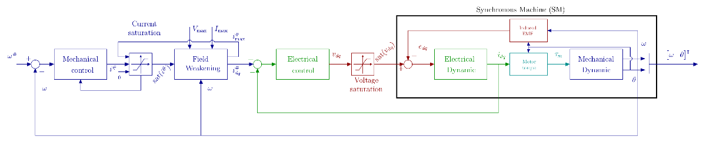
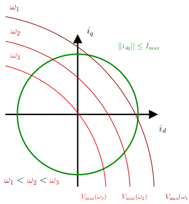

# Field-weakening

# Introduction

This section describes some of the work obtained as part of Hiba Houmsi’s thesis work, in collaboration with Federico Bribiesca Argomedo, Paolo Massioni and Romain Delpoux. These results have been published in (Houmsi2023). As metionned in the saturation management page, voltage and currents may not exceed positive values $V_{{\mathrm{m}\mathrm{a}\mathrm{x}}}$ and $I_{{\mathrm{m}\mathrm{a}\mathrm{x}}}$ , implying the following inequalities: 

-  $||v_{dq} ||=\sqrt{v_d^2 +v_q^2 }\le V_{{\mathrm{m}\mathrm{a}\mathrm{x}}}$ and 
-  $||i_{dq} ||=\sqrt{i_d^2 +i_q^2 }\le I_{{\mathrm{m}\mathrm{a}\mathrm{x}}}$ .  

At steady state, the electrical equation of the motor leads to: 

 $v_{dq} =Ri_{dq} +p\omega \mathcal{J}Li_{dq} +p\omega \left(\begin{array}{c} 0\\ \phi_f  \end{array}\right)$ ,

 so the saturation constraints is: 

 $ $ \begin{array}{rl} ||i_{dq} ||\le  & I_{{\mathrm{m}\mathrm{a}\mathrm{x}}} \\ \left|\left|p\omega \left(\begin{array}{c} 0\\ phi_f  \end{array}\right)+(R+p\omega \mathcal{J})i_{dq} \right|\right|\le  & V_{{\mathrm{m}\mathrm{a}\mathrm{x}}} .
\end{array} $ $ 

 Note that the voltage constraint will not allow maximum current to be reached at high speed:

While the current i_q is set by the motor torque to be supplied: 

 $\tau_m =\frac{3}{2}p\phi_f i_q$ ,

the i_d current can be controlled to stay within the voltages limits while reaching higher speeds at a given torque. This is called field-weakening. The strategy proposed here is the implementation of the solution proposed in **(Houmsi2023)** on an embedded industrial target using RCP. This strategy has been the subject of numerous research studies, for example **(Lu2010, Verl1998, Zordan2000)**.

# Formulation of the optimisation problem

The desired behavior is the minimum steady state currents i_{dq} to reach a given speed \\omega at a specific load torque \\tau under voltage and current constraints. The mathematical formulation is given by: 

 $ $ \begin{array}{l} \min_{i_d ,i_q } ~~i_d^2 +i_q^2 ,\\ \textrm{s.t}\\ \begin{array}{ccl} L\frac{di_{dq} }{dt} & = & v_{dq} -Ri_{dq} -p\omega L\mathcal{J}i_{dq} -e_{dq} =0\\ \|i_{dq} {\|}^2  & = & i_d^2 +i_q^2 \le I_{max}^2 \\ \|v_{dq} {\|}^2  & = & v_d^2 +v_q^2 \le V_{max}^2 \\ i_q  & = & \frac{2}{3}\frac{\tau }{p\phi_f }. \end{array}
\end{array} $ $ 

 Substituting the second equation into the forth, we reformulate the voltage constraint into the dq current frame, the optimization problem becomes: 

 $ $ \begin{array}{l} \min_{i_d ,i_q } ~~i_d^2 +i_q^2 ,\\ \textrm{s.t}\\ \begin{array}{rcl} i_d^2 +i_q^2  & \le  & I_{max}^2 \\ (i_d +a(\omega ))^2 +(i_q +b(\omega ))^2  & \le  & c(\omega )\\ i_q  & = & \frac{2}{3}\frac{\tau }{p\phi_f }. \end{array}
\end{array} $ $ 

 We define \\Gamma = \\{\\omega,\\tau, V_{max}, I_{max}\\}, the parameters set, and 

 $$ \left\lbrace \begin{array}{c} K(\omega )=\frac{p\omega \phi_f }{R^2 +(p\omega L)^2 },\\ a(\omega )=K(\omega )p\omega L,\\ b(\omega )=K(\omega )R,\\ c(\omega )=\frac{V_{max}^2 }{R^2 +(pL\omega )^2 }. \end{array}\right. $$ 

The optimization problem may be solved using a general Lagrange function including the inequality constraints and the Karush-Kuhn-Tucker (KKT) optimality conditions. The computation of the optimal solutions are not detailled here but can be found in **(Houmsi2023)**.

# KKT Field-Weakening algorithm

Define 

-  $\displaystyle \begin{array}{l} \kappa_1 (\omega )=\frac{-a(\omega )^2 -b(\omega )^2 +c(\omega )-I_{{\mathrm{m}\mathrm{a}\mathrm{x}}}^2 }{2a(\omega )}\\ \kappa_2 (\omega )=-\frac{b(\omega )}{a(\omega )}\\ \Delta (\omega )=4\left(I_{{\mathrm{m}\mathrm{a}\mathrm{x}}}^2 \left(\kappa_2 (\omega )^2 +1\right)-\kappa_1 (\omega )^2 \right); \end{array}$ 

 and 

-  $\displaystyle \begin{array}{l} i_1 (\omega )=\sqrt{c(\omega )-a(\omega )^2 }-b(\omega )\\ i_2 (\omega )=-\frac{2\kappa_1 (\omega )\kappa_2 (\omega )+\sqrt{\Delta (\omega )}}{2\left(\kappa_2 (\omega )^2 +1\right)}\\ i_4 (\omega )=\sqrt{c(\omega )}-b(\omega );\\ i^{\# } =\frac{2}{3}\frac{\tau_m^{\# } }{p\phi_f }; \end{array}$ 

 **Algorithm**

Inputs : $(\tau_m ,\omega ,V_{{\mathrm{m}\mathrm{a}\mathrm{x}}} ,I_{{\mathrm{m}\mathrm{a}\mathrm{x}}} )\in \Gamma$ 

Output: $(I_d^{\# } ,I_q^{\# } )\in \Gamma$ 

 $$ if(i^{# } <i_1 (\omega )||i_1 (\omega )\ge I_{\max } ) $$ 

 $$ \ldots\ldots.i_d^{# } =0; $$ 

 $$ \ldots\ldots.i_q^{# } =i^{# } ; $$ 

 $$ else $$ 

 $$ \ldots\ldots.if\left(i_1 (\omega )<i_2 (\omega )\,&\,!\left(i_2 (w)^2 +{\left(-\sqrt{c(w)-{\left(i_2 (w)+b(w)\right)}^2 }-a(w)x\right)}^2 <=I_{{\mathrm{m}\mathrm{a}\mathrm{x}}}^2 \right)\,&\,\Delta (\omega )>0\right); $$ 

 $$ \ldots\ldots\ldots\ldots..i_{{\mathrm{s}\mathrm{a}\mathrm{t}}} =\min (i_2 (\omega ),I_{{\mathrm{m}\mathrm{a}\mathrm{x}}} ); $$ 

 $$ \ldots\ldots.else $$ 

 $$ \ldots\ldots\ldots\ldots..i_{{\mathrm{s}\mathrm{a}\mathrm{t}}} =\min (i_4 (\omega ),I_{{\mathrm{m}\mathrm{a}\mathrm{x}}} ); $$ 

 $$ \ldots\ldots.end $$ 

 $$ \ldots\ldots.if\left(i^{# } >\min (i_{{\mathrm{s}\mathrm{a}\mathrm{t}}} ,I_{{\mathrm{m}\mathrm{a}\mathrm{x}}} )\right) $$ 

 $$ \ldots\ldots\ldots\ldots..i^{# } =\min (i_{{\mathrm{s}\mathrm{a}\mathrm{t}}} ,I_{{\mathrm{m}\mathrm{a}\mathrm{x}}} ); $$ 

 $$ \ldots\ldots.end $$ 

 $$ \ldots\ldots.i_d^{# } =\sqrt{c(\omega )-(i^{# } +b(\omega )^2 }-a(\omega ); $$ 

 $$ \ldots\ldots.i_q^{# } =i^{# } ; $$ 

 $$ end $$ 

**Example**

To illustrate the field weakening algorithm offline, a Matlab LiveScript [fieldWeakeningLiveScript.mlx](./fieldWeakeningLiveScript.mlx) is proposed also available on [GitHub](https://github.com/rdelpoux/ctrl-elec/blob/main/MCU/fieldWeakening/fieldWeakeningLiveScript.mlx). 

The example compute the field weakening solution for the TI motor with paramerters : 

-  $\displaystyle R=0.656\Omega$ 
-  $\displaystyle L=0.35mH$ 
-  $\displaystyle \phi_f =6.6mWb$ 
-  $\displaystyle p=4$ 
-  $\displaystyle \omega_{{\mathrm{M}\mathrm{a}\mathrm{x}}} =700rad/s;$ 
-  $\displaystyle v_{{\mathrm{M}\mathrm{a}\mathrm{x}}} =12V$ 
-  $\displaystyle i_{{\mathrm{M}\mathrm{a}\mathrm{x}}} =10A$ 

 In this example, is imopsed an electromechnical torque of $\tau_m =0.1Nm$ corresponding to $i^{\# } =2.53A$ . For this motor, the base speed $\omega_{{\mathrm{b}\mathrm{a}\mathrm{s}\mathrm{e}}}$ , defined the higher speed possible at maximum torque without any id current $\omega_{{\mathrm{b}\mathrm{a}\mathrm{s}\mathrm{e}}} =194.236rad/s$ . After this speed, the field weakening maybe necessary according to the load torque required.

In the animation below, five cases are shown in succession:

1.  The desired speed is $\omega =100rad/s$ so that field weakening is not necessary.
2. With $\omega =\omega_{{\mathrm{b}\mathrm{a}\mathrm{s}\mathrm{e}}} =194.236rad/s$ , the voltage limit cross the current limit for $i_d =0A$ . It corresponds to the maximum speed without field weakening whatever the load.
3. $\omega =380rad/s$ , corresponds to the reference speed, under a load of 0.1Nm for which field weakening is not required.
4. Reaching $\omega =450rad/s$ , without field weakening. So we impose a négative current $i_d$
5. $\omega =600rad/s$ , cannot be reach under a load of 0.1Nm so the algorithm reduces the desired load.

An example for the real time implementation can be download and tested by following the intruction on [GitHub](https://github.com/rdelpoux/ctrl-elec/tree/main/MCU/fieldWeakening) 

# References

(Houmsi2023) H. Houmsi, F. B. Argomedo, P. Massioni and R. Delpoux, “A Karush-Kuhn-Tucker approach to field-weakening for Surface-Mounted Permanent Magnets Synchronous Motors,” *2023 International Conference on Control, Automation and Diagnosis (ICCAD)*, Rome, Italy, 2023, pp. 1-6, [doi.org/10.1109/ICCAD57653.2023.10152453](https://ec-lyon.hal.science/hal-04069379/).

**(Lu2010)** Lu, D., & Kar, N.-C. (2010). A review of flux-weakening control in permanent magnet synchronous machines. *IEEE Vehicle Power and Propulsion Conference*, 1–6. [doi.org/10.1109/VPPC.2010.5728986](https://doi.org/10.1109/VPPC.2010.5728986)

**(Verl1998)** Verl, A., & Bodson, M. (1998). Torque Maximization for Permanent Magnet Synchronous Motors. *IEEE Transactions on Control Systems Technology*, *6*(6), 740–745.

**(Zordan2000)** Zordan, M., Vas, P., Rashed, M., Bolognani, S., & Zigliotto, M. (2000). Field-weakening in high-performance PMSM drives: a comparative analysis. *IEEE Industry Applications Conference.*, *3*, 1718–1724 vol.3. [doi.org/10.1109/IAS.2000.882112](https://doi.org/10.1109/IAS.2000.882112)

